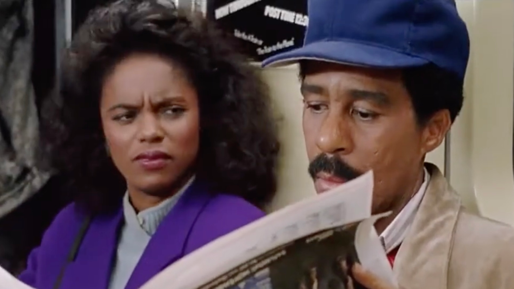

::: {.hero}
::: {.hero-inner}
# 1
# The Deaf Leading the Blind: What Silicon Valley's LLM's Cannot See

> *"...They have mouths, but cannot speak, eyes, but cannot see. They have ears, but cannot hear, noses, but cannot smell... Those who make them will be like them, and so will all who trust in them."* (Psalm 115:4–8, NIV)

<!-- {#fig-01} -->

In the unremarkable 1989 comedy *See No Evil, Hear No Evil*, Richard Pryor plays a blind man who refuses to acknowledge his blindness as shown in @fig-subway-denial, and Gene Wilder plays a deaf man who has become remarkably good at pretending otherwise. Together, they blunder through a murder mystery, each borrowing the faculty the other lacks, each performing a competence neither possesses. Pryor's *Wally* strides into bar brawls while Wilder's *Dave* shouts directions; *Dave* borrows *Wally*'s ears to detect approaching sirens. The comedy turns, precisely, on the gap between performed and actual perception (@fig-interview-mismatch).

::: {#fig-subway-denial .column-margin}


In this subway sequence, Wally (Pryor) performs "simulated sight", using memorized cues to mask his blindness.
:::

::: {#fig-interview-mismatch .column-margin}


During the job interview, Wally and Dave attempt to communicate across a complete sensory disconnect.
:::

The joke, as these things go, has aged rather well. It now serves as a reasonably accurate description of current vision-focused Large Language Models (LLMs).

Silicon Valley has spent the better part of a decade equipping AI with eyes. Visual encoders. Camera inputs. The image-upload button presented with the quiet confidence that the machine can now see.

What the product announcements rarely mention is the architecture sitting behind the lens: a language model, fundamentally and stubbornly textual, processing visual information by first converting it into words, then reasoning about those words, and finally—with the practiced confidence of a man who cannot see the bar fight he has just walked into—describing what it believes to be there.

This is the *Wally* problem. Vision, for most multimodal AI systems, is not perception. It is narration. Pixels enter; the language model converts them into tokens; the tokens are reasoned about [@su2025thinking]. Under light cognitive load, this works well enough. Under heavier demands (i.e. novel configurations, spatial ambiguity, anything requiring genuine inference rather than pattern retrieval) the visual attention collapses, and the model does what researchers have delicately termed "relying on linguistic priors" [@qian2026cognitive]. It confabulates. It narrates the world it expects rather than the one in front of it.

*Wally*, in other words, does not merely struggle to see. He actively replaces sight with confidence.

The instinctive counter-argument points to Tesla. If AI cannot see, how precisely is a two-tonne vehicle negotiating a American intersection without conspicuous incident?

It is a fair question. The answer, however, is not that Tesla has solved the vision problem. Tesla's v12 architecture maps pixels directly to steering and braking outputs, bypassing language altogether. There is no *Dave* whispering directions to *Wally* here. The blind man has simply been removed from the vehicle. The car does not *name* a stop sign before responding to it; it encodes the sign as a spatial object with associated coordinates and probabilities, and acts accordingly.

In this case *Dave* found a workaround. He stopped trying to hear.

The lesson Silicon Valley has not chosen to dwell on is that its flagship general-purpose models still have the language bottleneck firmly in place. The chatbot works, ostensibly, because the partnership is all it has.

Another apparent aesthetic counter-argument are the visual generation tools of which Midjourney is the prime example.

The remarkable images these generative models produce seem to have mastered the disconnect. The light behaves. The geometry holds. The shadows fall where shadows ought to fall. One is almost persuaded.

One is reminded of *Wally* discovering, late in the film, that he has become a rather convincing actor. Which is not the same thing as having recovered his sight.

What Midjourney has mastered is the *aesthetics of plausibility* [@su2025thinking]. Through heroic quantities of human feedback, it has learned the statistical grammar of what beautiful images look like—the precise pixel distribution that human evaluators label as "a convincing glass of wine," "a plausible city at night," "dramatic without being ridiculous." It does not know that glass shatters, that wine is liquid, or that the laws of refraction are not merely decorative suggestions. It is navigating a latent manifold of human visual taste with extraordinary precision.

The results are often beautiful. They are also, in any domain where spatial truth is the point, almost completely beside it.

That domain is science. When researchers recently evaluated leading multimodal models on scientific tasks requiring perception, interpretation, and reasoning over real multimodal data, performance was strikingly limited. In the Scientists’ First Exam benchmark, state-of-the-art systems achieved only around 30% accuracy, revealing substantial gaps in their ability to integrate visual information with scientific reasoning [@zhou2025sfe].

The vocabulary was intact. The perception was absent. *Wally*, as it turns out, knows all the right words for a bar fight.

This failure is, in one register, an academic finding. In another, it is alarming. Engineers developing collaborative tools for blind and low-vision users have discovered that AI-mediated visual description collapses on the very information those users most need: spatial structure [@li2026idea11y]. Where is the annotation relative to the diagram? Which cluster corresponds to which label? The visual grammar of collaborative work—arrangement, proximity, grouping as semantic signal—evaporates in translation. A system that cannot genuinely parse space cannot reconstruct it for the people whose relationship to space is already mediated and precarious. Asking *Wally* to give directions, in other words, has consequences that extend well beyond comedy.

The field is not entirely unaware of the predicament. A growing body of research advocates for what its proponents call "thinking *with* images" rather than thinking about them. In other words, reasoning natively in visual latent space, rather than routing every observation through the linguistic bottleneck first [@su2025thinking]. Whether this amounts to a genuine architectural reckoning or a more sophisticated performance of sight is, for now, an open question.

The partnership, for the moment, endures. *Wally* strides forward; *Dave* shouts what he thinks he lip-read. The demos are polished. The press releases are stirring. The benchmarks, carefully selected, are excellent.

The bar fight, however, is still going on. And it is becoming increasingly difficult, from the outside, to tell which punches are actually landing—and which are connecting, with great conviction, with the empty air.

The bar fight is still going on. *Dave* is still shouting directions. *Wally* is still swinging and occasionally, by some combination of statistical fortune and well-trained instinct, connecting. Whether that constitutes fighting, or merely a well-coordinated performance of multiple agents, is the question that remains open.

:::
:::